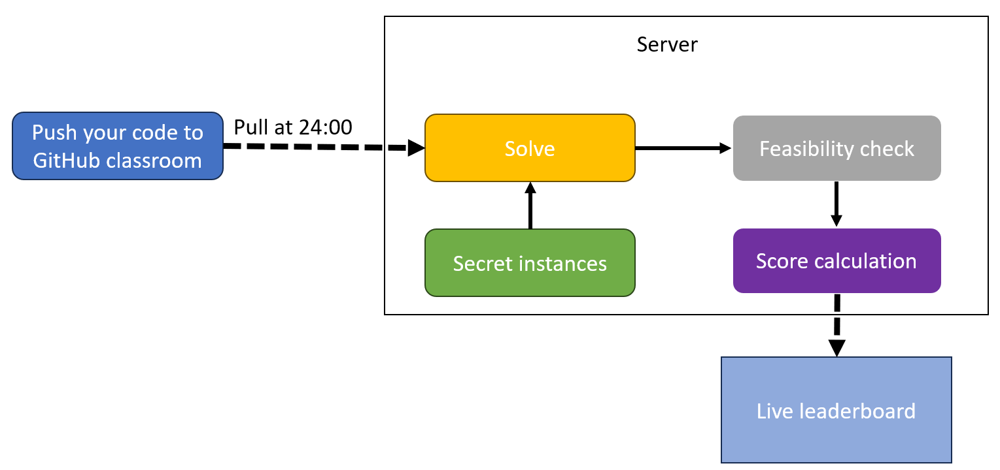
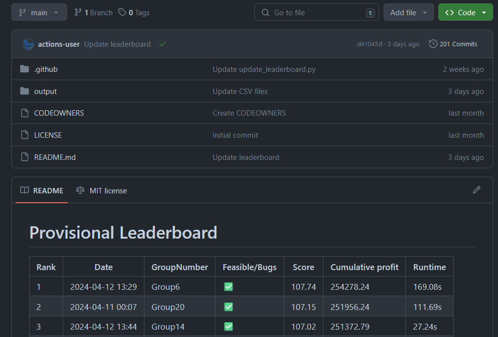

# GitHub Classroom student competition

This is a repository that includes everything to host a student competition supported by GitHub classroom. This repository was tried, tested, and improved in the course "Transportation & Logistics Management" of the [Industrial Engineering & Management master at the University of Twente](https://www.utwente.nl/en/education/master/programmes/industrial-engineering-management/).
We ran a vehicle routing problem (VRP) competition. To be precise, we gave the students a pickup-and-delivery problem with soft time windows to solve using heuristics and metaheuristic.
Students earned bonus points for an assignment in several rounds of the competition. In each round, we had a different focus regarding performance and computational time.

## Main idea

You use GitHub classroom to share starter code and example problem instances with students. Every day/week/whatever, you pull all the code of the students at a fixed time to a server. On this server, you run the code of students on secret instances. After running all code, you can calculate scores, e.g., based on profits and computational time. This score calculation is stored in a csv file. This csv file is pushed to a separate leaderboard repository. Here students can see their scores and can delve deeper into error codes related to their own run (if applicable).

## Structure

* student_repo: the repository you will provide to students via GitHub classroom. You can make a template or fork repository of this repo. It is needed to provide students with this starter code such that they provide the solution in the exact right format for us to read.
* server: the repo used on the server, more instructions can be found in the specific repository.
* leaderboard: the live leaderboard you can share with students. We will use a GitHub Actions workflow which is triggered whenever the repository is updated. The workflow can be found in the leaderboard ``.github`` folder. 

Below an example of how to leaderboard looks:

Thanks to [Breno Beirigo](https://github.com/brenobeirigo) for his help with all GitHub Classroom related, and to Giovanni Campuzano Arroyo for his help on getting the instances. Instances are based on the Li & Lim PDPTW benchmark instances, see: 10.1109/ICTAI.2001.974461 and https://www.sintef.no/projectweb/top/pdptw/li-lim-benchmark/